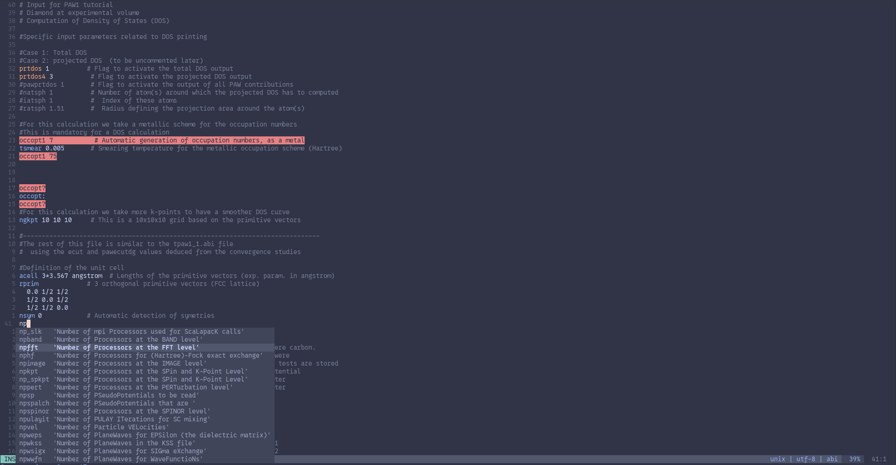

<p align="center">
  
</p>

# AbiVim

This repository is in relation with the [Abinit Project](https://www.abinit.org/) 
that you can also find on GithuB [here](https://github.com/abinit/abinit).**This repository is not part of the official toolchain**
**of Abinit Project.**

AbiVim can set up an autocompleter for Abinit's input files inside vim. It can parse mkdocs.py files from
Abinit's source code to generate lists of relevent data relating to Abinit's input variables.


<p align="center">
  
</p>

# Requirement 

You need at least vim version 8.2 for the autocomplete function to work. Any vim version should work for syntax coloring but vim >= 7.0 
is recommended. 

You need to have access to Abinit mkdocs locally to excute the script.


# Installation

To install the script just clone this repository somewhere 
```
git clone https://github.com/Chaostellaire/AbiVim.git AbiVim
```
or in ssh
```
git clone git@github.com:abinit/AbiVim.git AbiVim
```

To make the main script work you will also need an **Abinit documentation file**. 
You can find one in [Abinit's Github repo](https://github.com/abinit/abinit) in the `abimkdocs` directory. 

# Quick start

Use this command to quickly set up abivim features. This will create a `.vim` folder in `$HOME` and a `.vim/vimrc` folder containing 
`syntax on` statement

```
mkdir -p $HOME/.vim; echo "syntax on" >> $HOME/.vim/vimrc 
wget https://github.com/abinit/abinit/blob/master/abimkdocs/variables_abinit.py
./abivim.sh -vc -sv variables_abinit.py
```

# Usage

This section is about how to use the AbiVim script. AbiVim is for the moment only able to extract "varnames" and "mnemonics" which is used as a description of every entry. In practice it also extracts "varsets" and "vartypes" for syntax coloring.

## Simple data extraction

To only extract varnames and mnemonics you can run, with your input as  
```
./abivim.sh INPUT_FILE
```
extracted variables will be stored in a new directory `$pwd/extract/` as text files. You can check there if the extracted content is correct


## Vim configuration

AbiVim is able to configure your vim environment to enable vim autocomplete and syntax features.

### With AbiVim

To update your vimrc file and vim folder you can use `-vc` option flag. It will assume that your .vim directory is inside your HOME directory, and that your vimrc file is inside it.

```
./abivim.sh -vc variables_abinit.py #will use $HOME/.vim and $HOME/.vim/vimrc as vim directory and file
```

You can change the vim pathes with options `--vimdir-path` and `--vimrc-path`. Vim users like to have a .vimrc file in their HOME directory. The following command will suit them better :

```
./abivim.sh -vc --vimrc-path ~/.vimrc variables_abinit.py 
```

AbiVim will check if your vimrc has the required options to make autocomplete work. If they are not present it will append these options at the end of your vimrc file.

Next step is to create the abi.vim file that will be used to define abi filetype specific commands. Because abi.vim file will 
be copied in `.vim/ftplugin/`, you can modify it as you please. 
Note that "PLACEHOLDER" will be changed by the vimdir path you gave to AbiVim. If you would like another directory tree inside .vim, feel free
to modify line 17 and 18 in `abi.vim`.

If you already own a abi.vim file at `.vim/ftplugin/abi.vim` the script will ask you if you want to overwrite it.

To enable syntax highlight use the `-sv` flag. Syntax routines are independent from the vim autocomplete configuration.
However, if you which to only enable syntax highlight, you still need to declare 
.abi files as a custom filetype in your vimrc, activate syntax and extract variables.

The coloring of abinit variables relies on their sets (Basic, Bethe-Salpeter, ...). By default it is linked to your colortheme but custom colors can be applied with the `-c` flag. The default custom color provided, is taken from the [Catpuccin Mocha](https://catppuccin.com/) palette.
It is best suited for dark background terminals.

To customise your own color palette please refer to "Custom colors section"

### By hand

You can set up your vim by hand to have complete control over the directory tree sitting in `.vim`.

First you need to declare .abi files as a custom file type. Add to your vimrc the following :

```
au! BufRead,BufNewFile *.abi setfiletype abi
filetype plugin indent on
syntax on
```

This will enable Abinit's inputs file detection and call the scripts located at `.vim/ftplugin/abi.vim` and `.vim/syntax/abi.vim`

Next you need to add a 'ftplugin' directory to the '.vim' directory-tree. When vim detects that your file satisfies 
a filetype requirement, it will load the corresponding vimscript in `.vim/ftplugin/<filetype>.vim` in our case we 
declared all `*.abi` files to be an "abi" filetype.

The `abi.vim` provided is an exemple of an `.vim/ftplugin/abi.vim` file. It countains autocomplete options definition [1-11],
a custom completefunction that also prints help in the form of the full variable name (mnemonics) [17-46], and a custom function that detects
duplicates in your .abi file. You can use it as a base of syntaxic tools. Notably, you can change the variable popup description by editing 
the `l:desc` variable at line 35. The last command in this file, tells vim to execute the `HighlightRepeats` on save or loading of the file.
It will highlight any lines that countains duplicate as their first word, accounting for datasets notation.

There is no provided syntax file to put in `.vim/syntax/abi.vim` as is. Whoever you can generate one with the following command (Be aware 
that `abisyntax.sh` doesn't handle errors nor perfoms checks on your input):

```
./abisyntax.sh <path/to/variables_abinit.py> . true syntax false
```
This will generate `syntax/abi.vim` in the current working directory. You can modify it as you please. The verbosity of `syntax/abi.vim` 
makes it tedious to edit, prefer the method presented in custom colors.

# Custom Colors

## Modifying the color groups of abivars

Abinit's variables are colored according to their variable sets by default. 
To change this rule you'll need to construct a file (e.g. `abiset.txt`) that has
as many lines as their is variable entries. The line #i in this file correspond to the line #i in `extract/abivar.txt` and will associate
the variable i to the group i defined by `abiset.txt`. You can easily extract something from `variable_abinit.py` by modifying line 13 of
`abisyntax.sh`.

Finally you need to modify `guicolors`, `ctermcolors`, and if you don't use -c flag `setlink` hash tables. 
You need to add keys that corresponds to your new groups i.e. one key for each unique element in `abisyntax.sh` (e.g. 19). 
You can check how many unique element you have with the command :
```
sort FILE | uniq
```

## Modifying the custom color called by -c

To modify colors called by the -c flag you can just adjust the colors definition with hex encoding or with [vim 256-colors](https://vim.fandom.com/wiki/Xterm256_color_names_for_console_Vim) in `ctermcolors`

Keep in mind that you can also modify, the BrightComment group (defined by leadind '##') and Reapeat group color at the end of `abisyntax.vim`

## Modifying the colorscheme linked colors.

To modify the colors used without the -c flag you need to edit the `setlink` hash table. The values assigned to each Keys is a predifined 
group that vim's knows by default and that is affected by your current colorscheme. To see each possible values you can use the vim command :

```
:so $VIMRUNTIME/syntax/hitest.vim
```

Same as before, you can modify the linked group of Repeat at the end of the file.


## Deactivating BrightComments

Comment line 93 of `abisyntax.sh`


# Special thanks

Ioanna for the AbiVim logo and beta testing.
